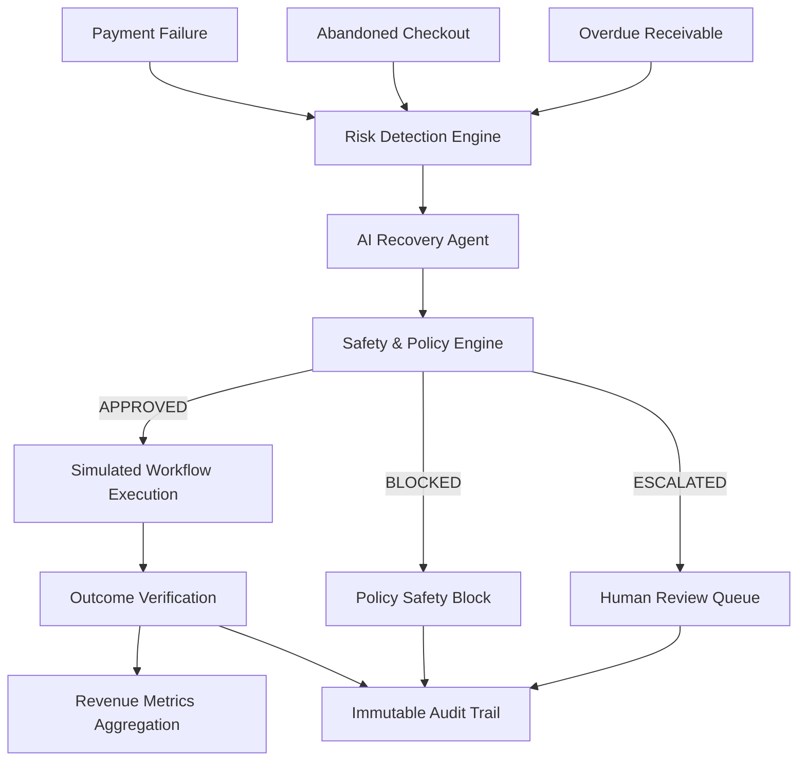

# ResolveAI
> **Autonomous Revenue Recovery & Safety Engine**  
> *Built for the Razorpay AI Buildathon 2026 — AI Revenue Recovery Track*

Revenue doesn't disappear only when a payment fails. It leaks through failed payments, abandoned checkouts, and overdue receivables.

**ResolveAI** detects revenue-at-risk events, diagnoses recovery opportunities, recommends bounded interventions, applies deterministic safety policies before execution, verifies outcomes, and records revenue impact through structured audit logs and metrics.

---

## Why ResolveAI?

Traditional payment recovery can easily degrade into:
- Blind, ungoverned retry loops
- Unsafe repeated card attempts
- Poor handling of ambiguous bank error states
- Lack of structured human escalation
- Weak decision auditability
- Unclear measurement of actual recovered revenue

ResolveAI replaces unguided retries with a governed recovery loop:

```
Detect → Diagnose → Policy Gate → Act → Verify → Audit
```

> **"AI recommends. Policy decides."**

---

## Revenue Leaks Covered

| Revenue Leak | ResolveAI Response | Domain Model / Workflow |
| :--- | :--- | :--- |
| **Failed Payments** | Cause-aware diagnosis + bounded retry + safety gate | `Payment` model & 30-payment benchmark |
| **Abandoned Checkouts** | Recovery nudge + outcome verification | Isolated `CheckoutSession` model & benchmark |
| **Overdue Receivables** | Invoice payment reminder + bounded follow-up | Isolated `Receivable` model & workflow |
| **Subscription Failures** | Subscription-aware recovery reasoning & messaging | Specialized intent detection on `Payment` |

*Checkout abandonment and overdue receivables are represented as distinct domain models rather than forcing them into standard payment transaction records.*

---

## Architecture



- **Risk Detection Engine**: Evaluates observable parameters (`status`, `amount`, `currency`, `retry_count`, `due_date`) to compute risk category and score.
- **AI Recovery Agent**: Formats structured 3-part evidence reasoning and recommends bounded actions.
- **Safety / Policy Engine**: Enforces 6 deterministic safety rules to approve, block, or escalate recommendations.
- **Bounded Recovery**: Executes non-financial simulated recovery actions (`PROMPT_RETRY`, `HUMAN_REVIEW`, `STATUS_MONITOR`, `NO_OP`).
- **Outcome Verification**: Monitors recovery results and updates record states (`RECOVERED`, `FAILED`, `BLOCKED`, `ESCALATED`, `MONITORING`, `NO_ACTION`).
- **Revenue Metrics**: Aggregates deduplicated recovered revenue by currency and compares performance against a naive retry baseline.
- **Audit Trail**: Logs complete decision traces for 100% explainability.

---

## AI Diagnosis & Evidence Boundary

The AI Recovery Agent generates recommendations using a strict 3-part evidence format:

$$\text{OBSERVED FACTS} \longrightarrow \text{INFERENCE} \longrightarrow \text{RECOMMENDATION}$$

### Evidence Boundary Rule
The agent reasons **strictly** from observed payment, checkout, or invoice data. It **never claims**:
- Insufficient funds
- Expired cards
- Gateway internal errors
- Customer payment history
- Customer credit score or cash-flow problems

unless those specific facts explicitly exist in the record.

*Note: The engine includes a deterministic fallback generator so full evaluation functions seamlessly even when external LLMs are offline or unconfigured.*

---

## Safety & Policy Engine

The Policy Engine acts as an authoritative gatekeeper between AI recommendations and execution.

### Policy Rules
1. `RULE_001` (**Completed Payment Protection**): Blocks retries on already completed transactions.
2. `RULE_002` (**Maximum Retry Limit**): Blocks automated retries when prior attempts $\ge 3$.
3. `RULE_003` (**Low Confidence Threshold**): Escalates recommendations when confidence score $< 0.70$.
4. `RULE_004` (**Active Bank Dispute / Chargeback**): Escalates active disputes for mandatory human review.
5. `RULE_005` (**Missing Required Information**): Blocks execution if payment ID or explanation is missing.
6. `RULE_006` (**Disallowed Action Type**): Blocks unauthorized action types.

**Rule Precedence**: $\text{BLOCKED} > \text{ESCALATED} > \text{APPROVED}$

> *"The AI can recommend an action. It cannot override the safety layer."*

---

## Bounded Recovery Actions & Outcomes

### Supported Action Types
- `PROMPT_RETRY`: Trigger customer retry prompt, checkout nudge, or invoice reminder.
- `HUMAN_REVIEW`: Escalate case to human dispute or finance team.
- `STATUS_MONITOR`: Monitor pending bank settlement status.
- `NO_OP`: Zero intervention required.

### Recovery Outcome States
- `RECOVERED`: Payment or checkout successfully completed in simulation ($>\$0.00$ recovered).
- `FAILED`: Recovery attempt executed but payment remained uncollected ($0.00$ recovered).
- `BLOCKED`: Prevented by policy safety rules ($0.00$ recovered — safety protection).
- `ESCALATED`: Routed to human team due to high risk or dispute ($0.00$ recovered — safety protection).
- `MONITORING`: In-progress settlement monitored without action ($0.00$ recovered).
- `NO_ACTION`: Already settled or completed ($0.00$ action required).

---

## Benchmark Results

### 30-Payment Synthetic Benchmark

| Metric | Result |
| :--- | :--- |
| **Total Payments Evaluated** | 30 |
| **Failed-Payment Recovery Candidates** | 16 |
| **Successful Recoveries** | **8** ($50.00\%$ recovery success among failed payments) |
| **Failed Retries** | 4 |
| **Safety Blocked Actions** | 4 (Policy limit reached) |
| **Human Escalations** | 6 (Active disputes & ambiguous cases) |
| **Monitored / No-Op** | 8 |
| **Financial Side Effects** | **0** |

### Per-Currency Metrics Summary

| Currency | Evaluated | At-Risk Revenue | Recovered Revenue | Recovery Rate | Success Rate | Block Rate | Escalation Rate |
| :--- | :---: | :---: | :---: | :---: | :---: | :---: | :---: |
| **USD** | 9 | \$1,605.50 USD | **\$465.50 USD** | 28.99% | 50.00% | 11.11% | 22.22% |
| **EUR** | 8 | €1,205.00 EUR | **€490.00 EUR** | 40.66% | 40.00% | 12.50% | 25.00% |
| **GBP** | 7 | £835.25 GBP | **£315.25 GBP** | 37.74% | 40.00% | 14.29% | 14.29% |
| **CAD** | 6 | \$1,055.00 CAD | **\$125.00 CAD** | 11.85% | 25.00% | 16.67% | 16.67% |

---

## Naive Retry Baseline Comparison

ResolveAI is benchmarked against a **Naive Always-Retry Baseline** across the exact same 30 payment records:

| Metric | Naive Always-Retry Baseline | ResolveAI Governed Engine |
| :--- | :---: | :---: |
| **Policy Governance** | False (Unsafe) | True (Governed) |
| **Total Retries Attempted** | 16 retries | 12 recovery attempts |
| **Max Retry Limit Violations** | **4 Unsafe Retries** | **0 (Blocked by Policy)** |
| **Safety Blocks Enforced** | 0 | **4** |
| **Human Escalations** | 0 | **6** |
| **Financial Side Effects** | Uncontrolled | **0** |

> *"ResolveAI optimizes recovery under safety constraints rather than blindly maximizing retries."*

---

## Checkout Abandonment Benchmark (Isolated)

Evaluating 6 synthetic checkout session scenarios (`chk_01` to `chk_06`):

- **Total Sessions Evaluated**: 6
- **Outcomes**: 3 RECOVERED, 1 FAILED, 1 BLOCKED, 1 MONITORING
- **Recovered Revenue**: **\$120.00 USD**, **€180.00 EUR**, **£95.00 GBP** (Total \$395.00 equivalent recovered out of \$1,055.00 at risk across 4 currencies).

---

## Overdue Receivables Capability

Inspects and processes overdue invoices (`rc_01` to `rc_06`) carrying explicit invoice parameters (`outstanding_amount`, `due_date`, `days_overdue`, `status`: `OPEN`, `PARTIALLY_PAID`, `OVERDUE`, `PAID`):

$$\text{OVERDUE / PARTIALLY\_PAID} \longrightarrow \text{Risk Assessment} \longrightarrow \text{Payment Reminder Rec} \longrightarrow \text{Policy Gate} \longrightarrow \text{Outcome Check}$$

---

## Subscription-Aware Recovery

Subscription intent is detected from description keywords (`subscription`, `renewal`, `tier upgrade`). When detected, the AI Recovery Agent produces subscription-aware inferences (*"Recurring subscription renewal failure detected; prompt customer retry is appropriate for subscription billing continuity"*) while maintaining existing bounded action enums (`PROMPT_RETRY`).

---

## Immutable Audit Trail

Every transaction evaluation generates a comprehensive, searchable audit log entry storing:
1. Record metadata & initial status
2. Risk assessment, score, and category
3. AI recommendation, explanation, and confidence
4. Policy decision, evaluated rules, and violations
5. Workflow action attempted, outcome, and recovered amount
6. Step-by-step execution timestamp logs

---

## Autonomous Oversight Architecture (Proposed Model)

The dashboard presents a 3-tier safety oversight model for autonomous follow-up:

- **Level 1 — Recovery Agent**: Detects opportunities, diagnoses causes, and proposes recovery strategies.
- **Level 2 — Review Agent**: Validates evidence boundaries, reasoning quality, and rule compliance.
- **Level 3 — Guardian Oversight**: Monitors system-wide exception rates, halts repeated failures, and triggers human escalation.

> **Loop**: $\text{REMEMBER} \longrightarrow \text{FOLLOW UP} \longrightarrow \text{VERIFY} \longrightarrow \text{ESCALATE}$

---

## Technology Stack & Project Structure

- **Backend**: Python 3.12, FastAPI, Uvicorn
- **Database / ORM**: SQLite, SQLAlchemy
- **Data Validation**: Pydantic v2
- **Frontend Dashboard**: Vanilla HTML5, Vanilla CSS3 (Custom Design System), JavaScript (ES6)

```
resolve-ai/
├── app/
│   ├── main.py                     # FastAPI Application Server
│   ├── database.py                 # SQLite Database Connection
│   ├── models.py                   # Payment ORM Model
│   ├── models_checkout.py          # CheckoutSession ORM Model
│   ├── models_receivable.py        # Receivable ORM Model
│   ├── models_audit.py             # AuditLog ORM Model
│   ├── seed.py                     # Synthetic Payment Dataset Seed
│   ├── seed_checkout.py            # Synthetic Checkout Dataset Seed
│   ├── seed_receivable.py          # Synthetic Receivable Dataset Seed
│   ├── evaluate_batch.py           # Benchmark Runner CLI Script
│   ├── schemas_*.py                # Pydantic Schemas (Risk, Recovery, Policy, Metrics)
│   ├── services/
│   │   ├── risk_engine.py          # Deterministic Risk & Diagnosis Engine
│   │   ├── recovery_agent.py       # AI Recovery Agent & Fallback Generator
│   │   ├── policy_engine.py        # 6-Rule Policy Engine Gatekeeper
│   │   ├── workflow_engine.py      # Simulated Workflow Execution Engine
│   │   ├── metrics_service.py      # Metrics Aggregator & Audit Logger
│   │   ├── baseline_evaluator.py   # Naive Always-Retry Baseline Evaluator
│   │   ├── batch_evaluator.py      # 30-Payment Batch Benchmark Service
│   │   ├── checkout_evaluator.py   # Checkout Batch Evaluator
│   │   └── receivable_evaluator.py # Receivable Batch Evaluator
│   ├── routers/                    # REST API Endpoints
│   └── static/                     # Web Dashboard Assets (index.html, style.css, app.js)
├── tests/                          # 68 Comprehensive Unit Tests
│   ├── test_payments.py
│   ├── test_risk.py
│   ├── test_recovery.py
│   ├── test_policy.py
│   ├── test_workflow.py
│   ├── test_metrics.py
│   ├── test_baseline.py
│   ├── test_cause_aware.py
│   ├── test_subscription_recovery.py
│   └── test_checkout_abandonment.py
└── README.md
```

---

## How to Run Locally

### 1. Prerequisites & Installation
Ensure Python 3.10+ is installed:

```bash
git clone https://github.com/Turya-Kalburgi/revision.java.git resolve-ai
cd resolve-ai
pip install -r requirements.txt
```

### 2. Run the 30-Payment Benchmark CLI
Execute the end-to-end 30-payment evaluation runner:

```bash
python3 -m app.evaluate_batch
```

### 3. Run Unit Tests
Run all 68 unit tests:

```bash
python3 -m unittest discover tests
```

### 4. Start Local Development Web Server
Launch the FastAPI app and open the web dashboard:

```bash
python3 -m uvicorn app.main:app --host 127.0.0.1 --port 8000
```

Open `http://127.0.0.1:8000` in your web browser to view the ResolveAI Dashboard.

---

## Core API Endpoints

- `GET /` — Serve Judge-Facing ResolveAI Web Dashboard (`index.html`)
- `GET /metrics/summary` — Aggregate multi-currency metrics summary, baseline comparison, & checkout metrics
- `GET /audit/logs?limit=100` — Retrieve immutable audit trail decision logs
- `POST /payments/evaluate-batch` — Trigger end-to-end 30-payment benchmark evaluation
- `GET /payments/` — List all synthetic payments
- `POST /risk/assess/{payment_id}` — Run Risk Assessment & Diagnosis for a payment
- `POST /recovery/recommend/{payment_id}` — Generate AI Recovery Recommendation
- `POST /policy/evaluate/{payment_id}` — Evaluate Policy Engine safety rules
- `POST /workflow/execute/{payment_id}` — Execute simulated recovery workflow

---

## Demo Safety Disclaimer

This project uses synthetic payment data and simulated recovery outcomes. **No real money movement or external financial API calls are executed.** The benchmark is designed to evaluate decision quality, policy enforcement, recovery workflow execution, auditability, and measurable revenue impact in a safe environment.

---

*Built for the Razorpay AI Buildathon 2026 — AI Revenue Recovery Track*
